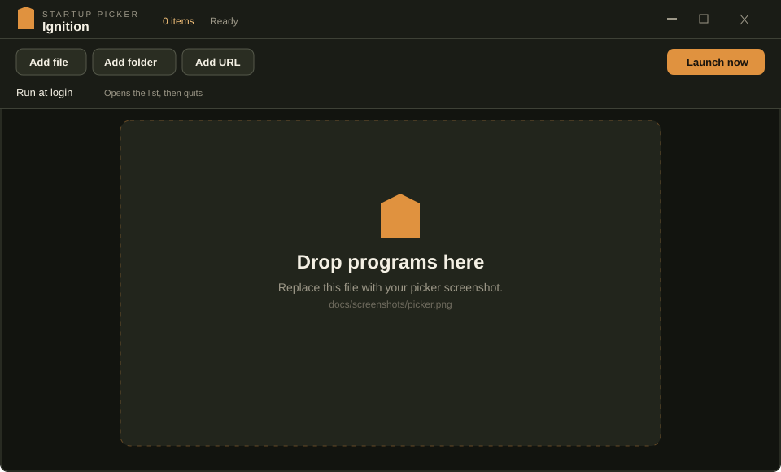
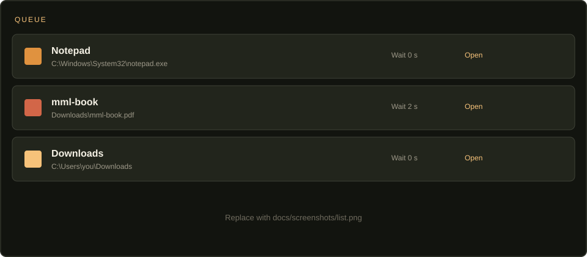
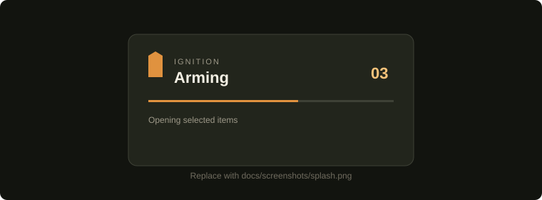

<div align="center">
  
</div>

<div align="center">


[](LICENSE)

</div>

<div align="center">
  <b>A lightweight Windows startup picker.</b><br>
  Queue apps, files, folders, and links. At login they open, then Ignition closes itself.
</div>

<br>

<div align="center">
  
</div>

---

## Table of Contents

- [Showcase](#showcase)
- [Key Features](#key-features)
- [What it can open](#what-it-can-open)
- [Installation](#installation)
- [How to Use](#how-to-use)
- [Star History](#star-history)
- [License](#license)

---

<div>

## <a name="showcase"></a>Showcase

</div>

<details open>
  <summary><b>View the picker and boot splash</b></summary>
  <br>
  <div>
    <table>
      <tr>
        <td valign="top" width="50%">
          <br>
          <b>Per-item control</b><br>
          <i>Enable, delay, open, or remove anything in the list. File icons come from Windows.</i>
        </td>
        <td valign="top" width="50%">
          <br>
          <b>Login splash</b><br>
          <i>At boot it shows a small overlay, launches the enabled items, then quits.</i>
        </td>
      </tr>
    </table>
  </div>
</details>

> Screenshots above are placeholders. Drop real captures into `docs/screenshots/` as `picker.png`, `list.png`, and `splash.png`, then point the README at those files. See [`docs/screenshots/README.md`](docs/screenshots/README.md).

---

<div>

## <a name="key-features"></a>Key Features

| | Feature | Description |
|:---:|:---|:---|
| | **Anything Windows can open** | Apps, documents, folders, and `http(s)` links |
| | **Run at login** | Registers Ignition in your user startup list with a `--launch` flag |
| | **Self-closing boot** | Splash, stagger, then the process exits so nothing stays resident |
| | **Per-item wait** | Extra seconds before that row opens, plus a global post-login delay and gap |
| | **Drag and drop** | Drop files or folders onto the window to add them |
| | **Native icons** | Each row shows the Windows shell icon for that path |
| | **Tiny stack** | Tauri 2, Rust, and static HTML/CSS/JS. No Electron, no React |
| | **Current-user installer** | NSIS setup, no admin required |

</div>

---

<div>

## <a name="what-it-can-open"></a>What it can open

| Kind | Supported |
| :--- | :---: |
| **Programs** (`.exe`, `.lnk`, `.bat`, …) | Yes |
| **Files** (docs, PDFs, anything associated) | Yes |
| **Folders** | Yes |
| **URLs** | Yes |

</div>

---

<div>

## <a name="installation"></a>Installation

### Windows installer (recommended)

1. Open the **[Releases](../../releases)** page.
2. Download the latest `Ignition_x.y.z_x64-setup.exe`.
3. Run the installer (current user, no admin).
4. Add your list, turn on **Run at login**.

Until a release is published, build from source below.

</div>

<div>

### Building from source

**Prerequisites:** [Rust](https://rustup.rs/) (MSVC toolchain) · [Node.js](https://nodejs.org/) 20+ · [Python 3](https://www.python.org/downloads/) · [WebView2](https://developer.microsoft.com/microsoft-edge/webview2/) (already on Windows 11) · [Visual Studio Build Tools](https://visualstudio.microsoft.com/visual-cpp-build-tools/) with the C++ workload

</div>

```bash
git clone https://github.com/4anti/Ignition.git
cd Ignition
npm install
npm run dev      # picker window
npm run build    # NSIS installer under src-tauri/target/release/bundle/nsis
```

---

<div>

## <a name="how-to-use"></a>How to Use

| Step | Action | Description |
| :---: | :--- | :--- |
| 1 | **Add** | Use Add file / folder / URL, or drop paths onto the window |
| 2 | **Tune** | Toggle items, set **Wait** per row, set **After login** and **Gap** |
| 3 | **Arm** | Turn on **Run at login** |
| 4 | **Check** | **Launch now** fires the list without quitting. **Open** tests one item |

At the next sign-in, Ignition starts with `--launch`, waits the login delay, opens enabled items (honoring per-item waits and the gap), then exits.

</div>

---

<div>

## <a name="star-history"></a>Star History

<a href="https://star-history.com/#4anti/Ignition&Date">
  <picture>
    <source media="(prefers-color-scheme: dark)" srcset="https://api.star-history.com/svg?repos=4anti/Ignition&type=Date&theme=dark" />
    <source media="(prefers-color-scheme: light)" srcset="https://api.star-history.com/svg?repos=4anti/Ignition&type=Date" />
    
  </picture>
</a>

</div>

---

<div>

## <a name="license"></a>License

This project is licensed under the **PolyForm Noncommercial License 1.0.0**. Noncommercial use only. See [`LICENSE`](LICENSE) for the full terms.

---

*Developed by **4anti**.*

</div>
